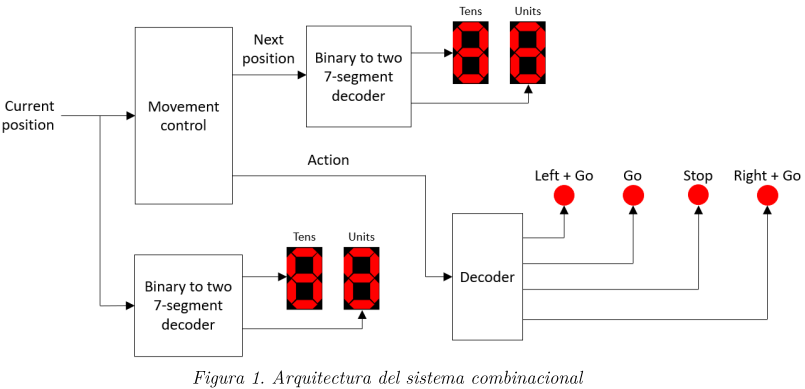
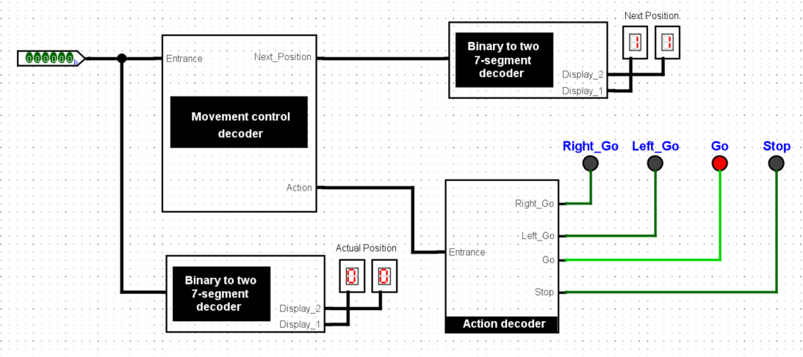
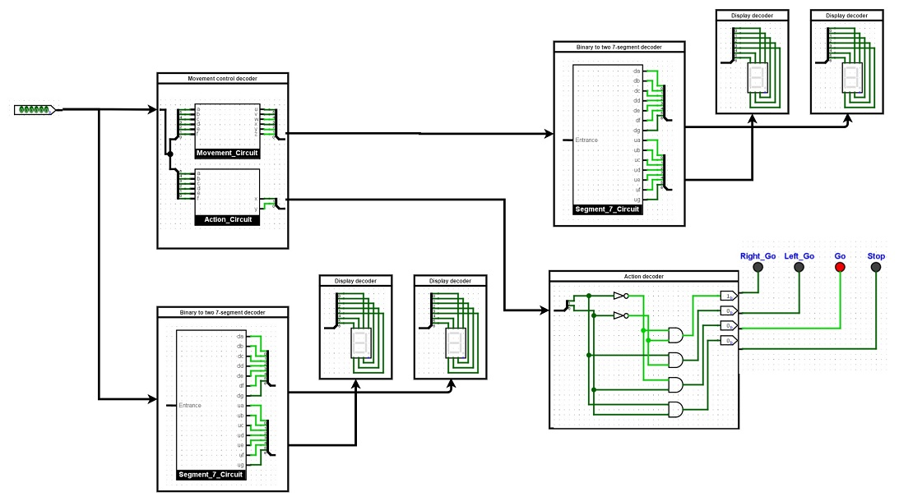

# Combinational Circuits Design - LAB 1

## Dev Environment

* **Logisim Version:** [V3.4.1](https://github.com/reds-heig/logisim-evolution/releases/tag/v3.4.1)
* **SO:** Windows 10 
* **JDK:** 1.8.0_271

## Proposal Architecture

## Solution Architecture 

## Circuit Architecture 

